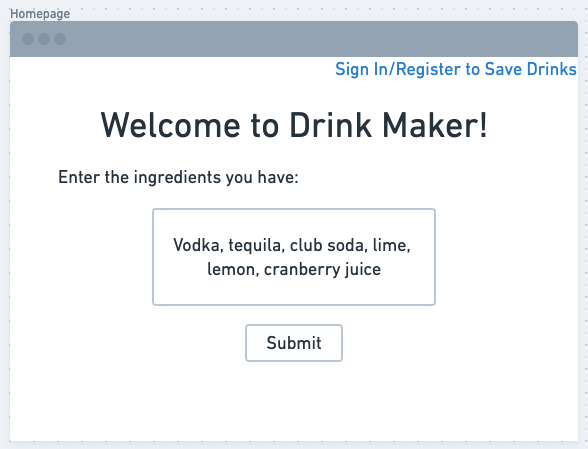
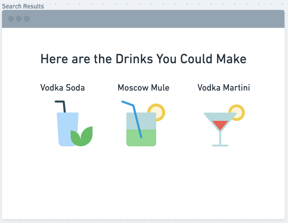
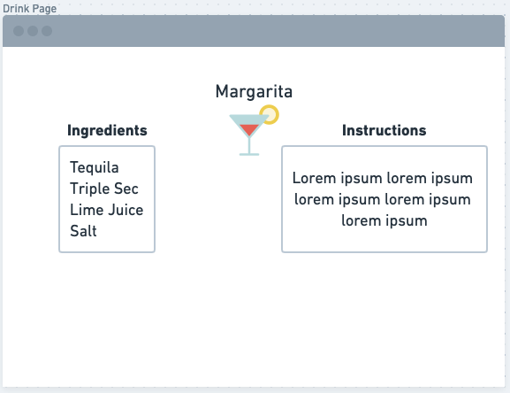

# Drink Maker

## Overview

Alcohol sales have increased more than 50% during quarantine compared to this time last year. People are passing the time by drinking, but sometimes just grabbing a liquor and a mixer can be boring. So here comes Drink Maker! 

Drink Maker allows people to select ingredients they have in their house and Drink Maker shows you different cocktails you could make. The site does not require someone to register or login, but they do have the option. If a user registers, then they can save drinks that they like to their account. During a time when people are looking for fun things to do in their homes, Drink Maker is the perfect solution!

## Data Model

The application will store Users and a User's Saved Drink

* a user can save drinks they like to their account
* the drinks are sourced from a cocktail API

An Example User:

```javascript
{
  username: "aaroncronin",
  password: // password hash
}
```
An Example User's Saved Drinks:

```javascript
{
  username: "aaroncronin" // references user,
  drinks: [Drink] // array of Drink schema
}
```
An Example Drink:

```javascript
{
  id: 123,
  name: "margarita",
  ingredients: [String],
  instructions: String,
  image: "margarita.png",
  alcoholic: True,
  glass: // type of glass the drink should be served in
}
```

## [Link to Commented First Draft Schema](db.js)

## Wireframes

/signin - login page


/register - register page


/homepage - login page



/searchresults - login page



/drink - login page



/saveddrinks - login page


## Site Map


## User Stories

1. as non-registered user, I can register a new account with the site
2. as a non-registered or registered user, I can see cocktails I can make by entering liquors and other ingredients I have in my house
3. as a non-registered or registered user, I can view a drink's details, such as ingredients and instructions on how to make
4. as a registered user, I can sign in to my account
5. as a signed in user, I can save drinks I like to my account
6. as a signed in user, I can view my saved drinks

## Research Topics

* (5 points) User authentication
    * I will use passport.js for user authentication
    * My site requires users to register/login in order to play the game and see their stats
    * I have never used the passport middleware, so I will have to learn how to implement and use it properly
* (5 points) react.js
    * I will use react for my frontend framework
    * I have never worked with react, only node for backend, so this will be a challenge for me
* (4 points) Client side form validation when user registers
    * users must enter a username and password to register
    * the "confirm password" field must match the "password" field at the register page

## [Link to Initial Main Project File](app.js) 

## Annotations / References Used

1. [passport.js authentication docs](http://passportjs.org/docs)

2. [react.js docs on getting started](https://reactjs.org/docs/getting-started.html)

3. [react.js tutorial](https://www.youtube.com/watch?v=sBws8MSXN7A)

