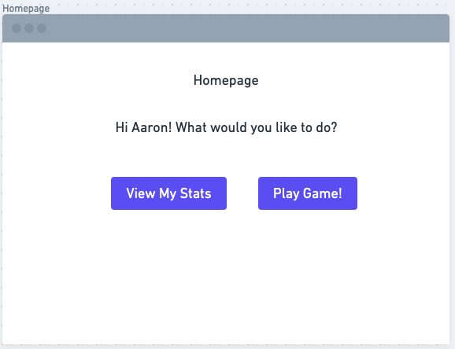
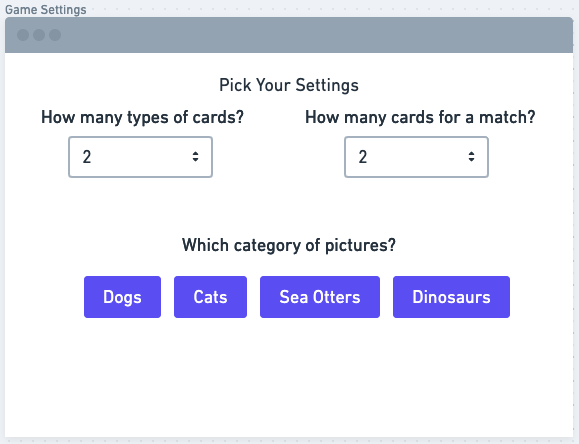
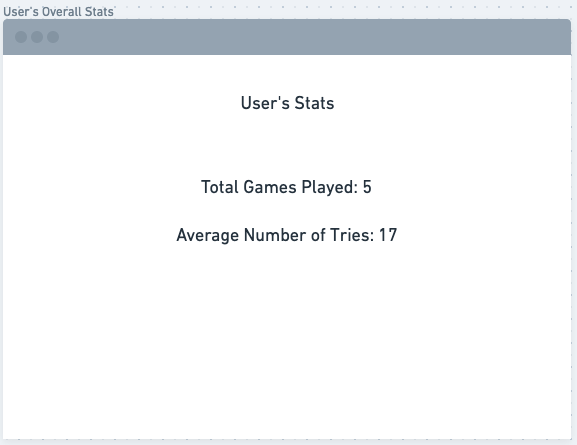
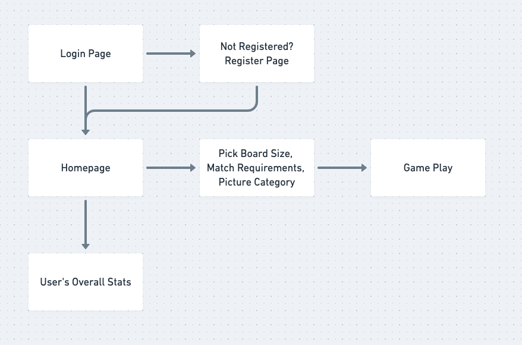

# Memory Game

## Overview

Everybody loves to procrastinate. Especially during this quarantine, people are always looking for something to do. So here comes Memory Game to give people something to do all day!

Memory Game is a web app that allows users to play a simple memory game. Once a user is logged in, they can choose the number of cards they want to play with, the number of cards that are required for a match, and even what kind of pictures they want to be on the cards. (There may be the possibility of users uploading their own pictures to play with). The app will keep track of a user's stats (like how many tries it takes to match all of the cards).

## Data Model

The application will store Users, Stats, and Lists of Pictures.

* a user can have game-specific stats and overall stats
* the category of pictures will be selected by a user for what they want the cards t be.

An Example User:

```javascript
{
  username: "aaroncronin",
  hash: // a password hash,
  overall_stats: // an object that stores overall game stats,
  game_stats: {tries: 3, matches: 0}// game specific stats, like counter keeping track of number of tries
}
```
An Example User's Stats:

```javascript
{
  username: "aaroncronin" // references user,
  games: // total number of games played
  average_tries: [
    {size4: 3, size5: 6, size6: 6, size7: 14} // sizes will from min to max possible
  ]// average number of tries to finish a game by board size
}
```
An Example List of Pictures:

```javascript
{
  name: "Dogs", // category of pictures
  pictures: [ // array will be filled with up to 15 or so pictures, then user chooses how big they want the board to be, which determines the number of pictures taken from this array
    "dogimage1.jpg",
    "dogimage2.jpg"
  ],
}
```

## [Link to Commented First Draft Schema](db.js)

## Wireframes

/login - login page


/register - register page


/homepage - login page



/gamesettings - login page



/overallstats - login page



/gameplay - login page


## Site Map



## User Stories

1. as non-registered user, I can register a new account with the site
2. as a user, I can log in to the site
3. as a user, I can select the number of cards I want to play with
4. as a user, I can select the number of cards required for a match
5. as a user, I can select the category of pictures to be disiplayed on the cards
6. as a user, I can play the memory game
7. as a user, I can view the stats for the current game I am playing
8. as a user, I can view my overall stats, which are accumulated from all the games I have played

## Research Topics

* (5 points) User authentication
    * I will use passport.js for user authentication
    * My site requires users to register/login in order to play the game and see their stats
    * I have never used the passport middleware, so I will have to learn how to implement and use it properly
* (5 points) react.js
    * I will use react for my frontend framework
    * I have never worked with react, only node for backend, so this will be a challenge for me
* (4 points) Client side form validation when user registers
    * users must enter valid strings for first name and last name
    * the "confirm password" field must match the "password" field at the register page

## [Link to Initial Main Project File](app.js) 

## Annotations / References Used

1. [passport.js authentication docs](http://passportjs.org/docs)

2. [react.js docs on getting started](https://reactjs.org/docs/getting-started.html)

3. [react.js tutorial](https://www.youtube.com/watch?v=sBws8MSXN7A)

